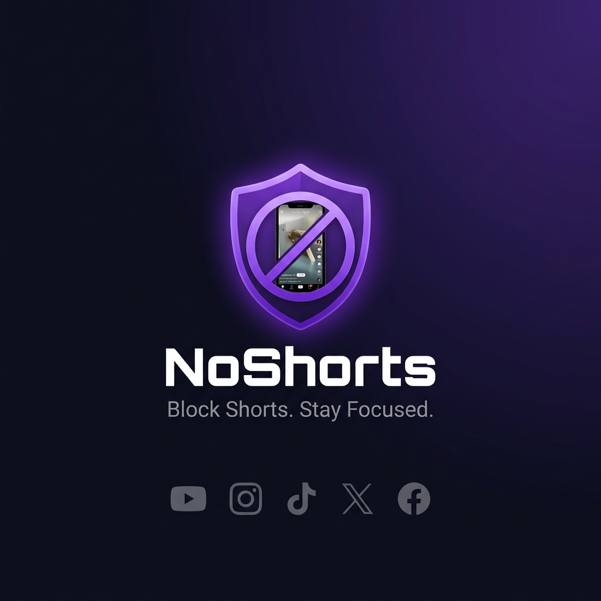

<p align="center">
  
</p>

<h1 align="center">ChromiumNoShorts</h1>

<p align="center">
  <strong>Anti Doom-Scroll Shield for Chromium Browsers</strong><br>
  Block short-form video content across YouTube, Instagram, TikTok, X, and Facebook — without breaking anything else.
</p>

<p align="center">
  
  
  
  
</p>

---

## 🎯 What It Does

**ChromiumNoShorts** is a lightweight browser extension that surgically removes short-form video content from your feed — Shorts shelves, Reels sections, TikTok feeds, and more — while leaving all regular content untouched.

No more getting pulled into an infinite loop of 30-second videos. Stay focused.

---

## ✨ Features

| Feature | Description |
|---|---|
| 🛡️ **Master Toggle** | One-click ON/OFF for the entire extension |
| 🎛️ **Per-Platform Control** | Enable/disable blocking per site independently |
| 🔀 **YouTube URL Redirect** | `/shorts/VIDEO_ID` → `/watch?v=VIDEO_ID` automatically |
| 🧠 **Smart DOM Scanning** | Uses MutationObserver to catch dynamically injected content |
| 📊 **Blocked Elements Counter** | Tracks how many elements have been hidden |
| 🔵 **Badge Indicator** | Toolbar badge shows `ON`/`OFF` at a glance |
| 💾 **Persistent Settings** | Your preferences survive browser restarts |

---

## 🚫 What Gets Blocked

### 📺 YouTube
- Shorts shelves on the homepage
- Individual Short thumbnails in grids and sidebars
- The **Shorts** tab in the sidebar and on channel pages
- Redirect from `/shorts/` URL → regular watch page

### 📸 Instagram
- **Reels** tab and feed entries
- Reels in the **Explore** page

### 🎵 TikTok
- The entire **For You** feed overlay (TikTok is a Shorts-only site)

### 𝕏 X (Twitter)
- **Videos for You** section
- Short video entries in the Explore tab

### 👥 Facebook
- **Reels** sections in the feed
- **Watch / Reels** dedicated page

---

## 🔧 How It Works

```
Browser Startup
      │
      ▼
background.js (Service Worker)
  • Initializes state in chrome.storage.local
  • Sets badge text: ON (purple) or OFF (gray)
  • Listens for stats updates from content scripts
      │
      ▼
content scripts injected per site
  ├── shared.js      → Core NoShorts API (init, observe, hideElements, redirectIfMatch)
  ├── youtube.js     → YouTube-specific selectors + URL redirect logic
  ├── instagram.js   → Instagram Reels selectors
  ├── tiktok.js      → TikTok feed blocker
  ├── twitter.js     → X/Twitter video sections
  └── facebook.js    → Facebook Reels sections
      │
      ▼
popup.html / popup.js
  • Reads and writes state from chrome.storage.local
  • Master toggle syncs across all tabs instantly
  • Per-platform toggles for granular control
  • Shows total blocked elements count
```

Each content script:
1. **Checks** `chrome.storage.local` for the extension's enabled state
2. **Scans** the DOM using CSS selectors for short-form content elements
3. **Hides** matched elements via CSS (`display: none`)
4. **Watches** for new content via `MutationObserver` (handles SPA navigation)
5. **Reports** blocked count back to the background worker

---

## 📦 Installation (Local / Developer Mode)

Since this extension isn't on the Chrome Web Store yet, install it manually:

1. **Download / Clone this repo**
   ```bash
   git clone https://github.com/DMJain/ChromiumNoShorts.git
   ```

2. **Open your Chromium browser** (Chrome, Edge, Brave, etc.)

3. **Go to Extensions page**
   - Chrome: `chrome://extensions`
   - Edge: `edge://extensions`
   - Brave: `brave://extensions`

4. **Enable Developer Mode** (toggle in top-right corner)

5. **Click "Load unpacked"** and select the `ChromiumNoShorts` folder

6. 🎉 The **NoShorts** icon will appear in your toolbar — you're all set!

---

## 📁 Project Structure

```
ChromiumNoShorts/
├── manifest.json          # Extension config (Manifest v3)
├── background.js          # Service worker: state, badge, stats
├── content/
│   ├── shared.js          # Core NoShorts API used by all scripts
│   ├── youtube.js/.css    # YouTube Shorts blocker
│   ├── instagram.js/.css  # Instagram Reels blocker
│   ├── tiktok.js/.css     # TikTok feed blocker
│   ├── twitter.js/.css    # X/Twitter video blocker
│   └── facebook.js/.css   # Facebook Reels blocker
├── popup/
│   ├── popup.html         # Extension popup UI
│   ├── popup.css          # Popup styles
│   └── popup.js           # Popup logic (reads/writes storage)
└── icons/
    ├── icon16.png
    ├── icon32.png
    ├── icon48.png
    └── icon128.png
```

---

## 🛠️ Tech Stack

- **Manifest Version**: 3 (latest Chrome extension standard)
- **Languages**: Vanilla JavaScript, CSS
- **APIs Used**: `chrome.storage.local`, `chrome.runtime`, `chrome.action`, `MutationObserver`
- **No dependencies** — zero npm packages, zero frameworks

---

## 📜 License

[MIT](LICENSE) — free to use, modify, and distribute.

---

<p align="center">Made with 🛡️ for focus &nbsp;•&nbsp; v1.0.0</p>
